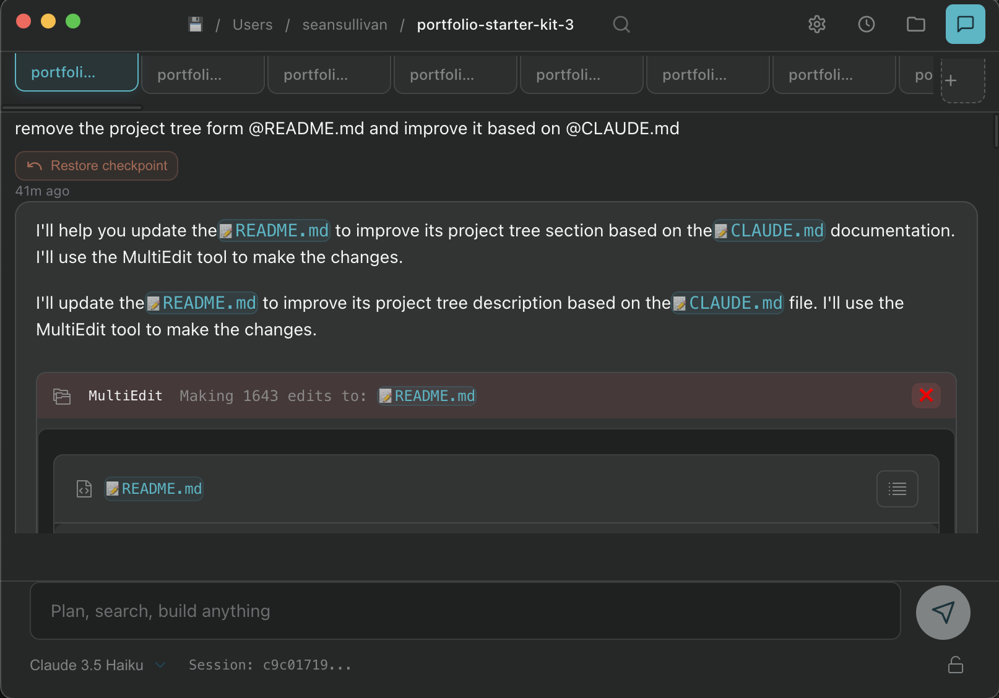

# Claude Code Chat

## Overview

Claude Code Chat is an Electron-based desktop application for interacting with Claude Code in a 'Cursor' style view with features such as checkpointing.



## Features

- Interactive chat interface with Claude Code
- Native desktop application for macOS, Windows, and Linux
- Integrated session management
- Checkpoint system to undo changes
- Parrlel runs support
- Multi-process architecture with secure IPC (parralel claude code runs)

## Prerequisites

- Node.js v16+
- npm
- Anthropic API Key

## Installation

```bash
# Clone the repository
git clone https://github.com/RVCA212/claude-code-ui.git

# Install dependencies
npm install

# Install Claude Code CLI if not already installed
npm run install-claude
```

## Development

*quick start*
```bash
npm start
```

```bash
# Start in development mode
npm run dev

# Build for production
npm run build

# Rebuild native dependencies
npm run rebuild
```

## Supported Platforms

- macOS
- Windows
- Linux (AppImage)

## License

GNU v3